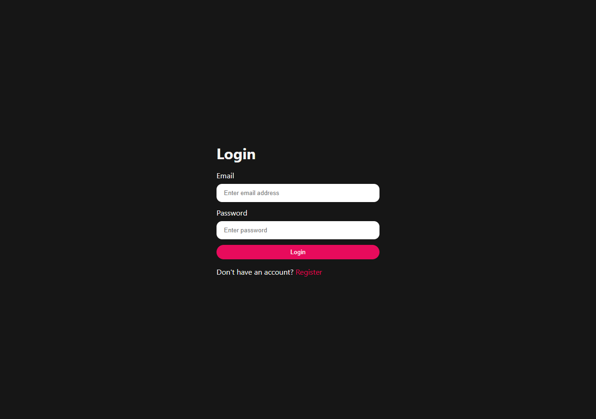
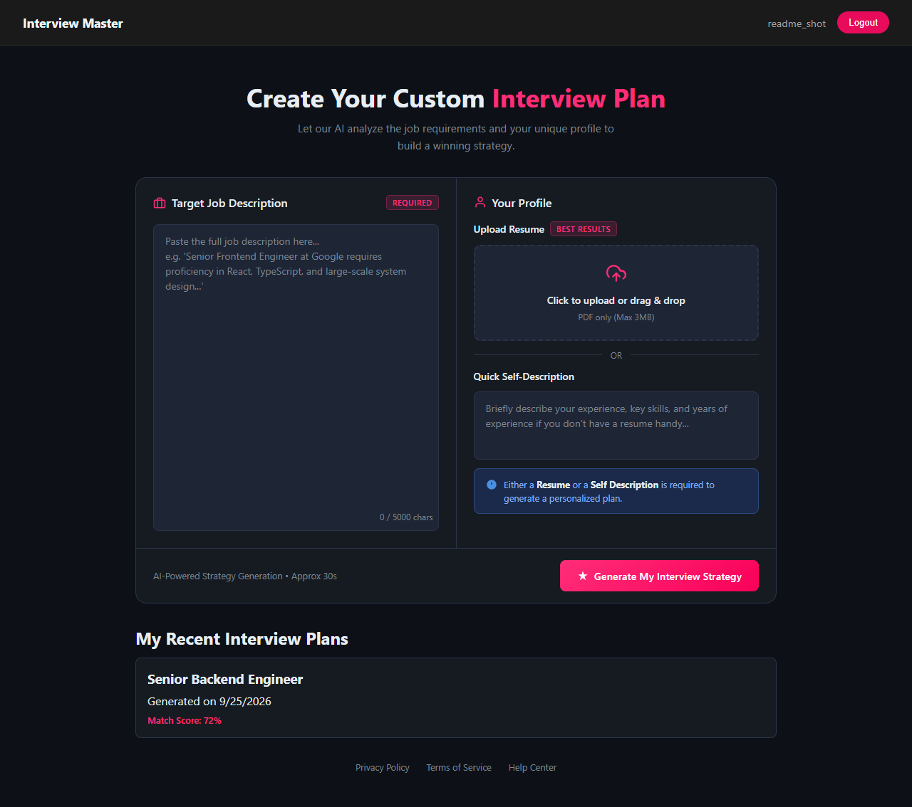
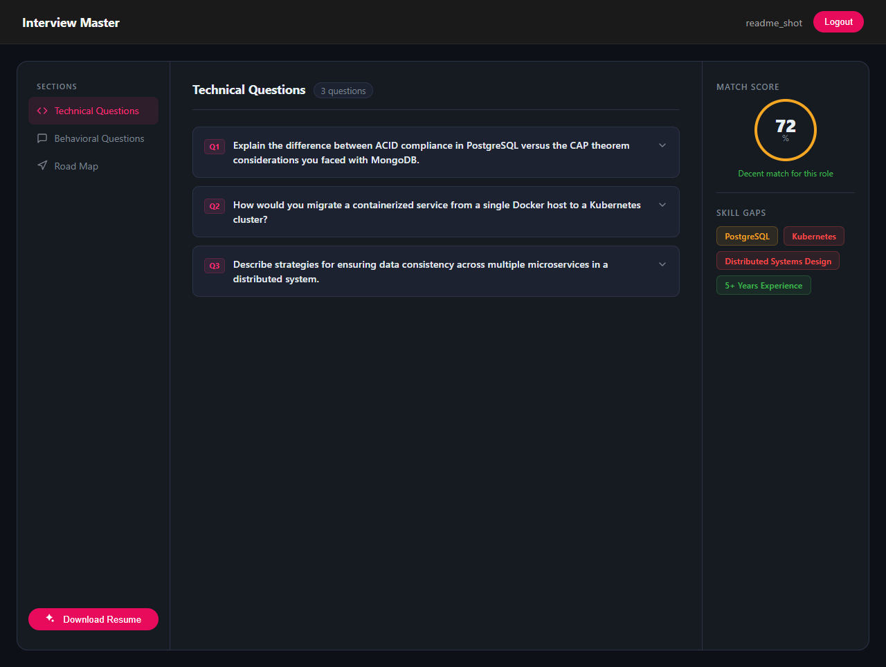

[](https://gitdiagram.com/hetshah24-06/ai-interview-prep/video)
# Interview Master

An AI-powered interview prep tool. Paste a target job description, add a
resume or a quick self-description, and get back a structured mock-interview
pack: a match score, likely technical and behavioral questions (each with
the interviewer's intention and a model answer), a skill-gap breakdown, a
day-by-day preparation roadmap, and a tailored, ATS-friendly resume PDF for
that specific job.

## Screenshots

| Login | Home | Interview Report |
|---|---|---|
|  |  |  |

## Why this project

Most "AI wrapper" demos pipe a prompt straight to an LLM and print whatever
comes back. This one doesn't:

- **LLM output is schema-constrained, not parsed.** Both the interview
  report and the generated resume are defined as Zod schemas, converted to
  a JSON schema, and passed to Gemini's `responseSchema` — the model is
  forced to return exactly that shape instead of free text that then has to
  be regex'd or hoped into structure.
- **Auth does real session invalidation, not just token expiry.** Logout
  adds the JWT to a blacklist collection (Mongo TTL-indexed to self-clean
  after 24h), so a copied cookie is dead immediately, not just "eventually."
- **A real multi-step pipeline:** PDF upload → text extraction (`pdf-parse`)
  → LLM analysis → structured storage → on-demand PDF regeneration
  (Gemini writes resume HTML, Puppeteer renders it).

## Tech stack

**Backend** — Node.js, Express 5, MongoDB/Mongoose, JWT (httpOnly cookies),
bcrypt, Zod (both for request validation and for constraining LLM output),
Multer, `pdf-parse`, Puppeteer, `@google/genai` (Gemini).

**Frontend** — React 19, React Router 7, Axios, Sass.

**Testing** — Jest + Supertest (backend).

## Getting started

Requires Node 18+, a MongoDB connection string (Atlas or local), and a
[Gemini API key](https://aistudio.google.com/apikey).

```bash
# Backend
cd Backend
npm install
cp .env.example .env   # fill in MONGO_URI, JWT_SECRET, GOOGLE_GENAI_API_KEY
npm run dev             # http://localhost:3000

# Frontend (separate terminal)
cd Frontend
npm install
cp .env.example .env    # defaults to http://localhost:3000, override if needed
npm run dev              # http://localhost:5173
```

Run the backend test suite with `cd Backend && npm test`.

## Project structure

```
Backend/
  src/
    controllers/   # request handling, one file per resource
    services/      # Gemini calls, Puppeteer PDF rendering
    models/        # Mongoose schemas
    middlewares/    # auth, file upload, rate limiting
    validators/     # Zod request-body schemas
    routes/
  tests/           # Jest + Supertest

Frontend/
  src/
    features/
      auth/         # login/register pages, auth context, navbar
      interview/    # home (report generation), report viewer
```

## API overview

| Route | Auth | Description |
|---|---|---|
| `POST /api/auth/register` | Public | Create an account, sets an auth cookie |
| `POST /api/auth/login` | Public | Log in, sets an auth cookie |
| `GET /api/auth/logout` | Public | Blacklists the current token, clears the cookie |
| `GET /api/auth/get-me` | Private | Current user, used to restore sessions on load |
| `POST /api/interview/` | Private | Generate a report from a job description + resume/self-description |
| `GET /api/interview/` | Private | List the logged-in user's reports |
| `GET /api/interview/report/:id` | Private | Fetch one report |
| `POST /api/interview/resume/pdf/:id` | Private | Generate and download a tailored resume PDF for that report |

`/api/auth/login` and `/api/auth/register` are rate-limited (20 requests /
15 min per IP).

## Deployment notes

- Set `NODE_ENV=production` on the backend host so auth cookies switch to
  `Secure` + `SameSite=None` (required for a cross-origin frontend/backend
  split, e.g. Vercel + Render).
- Set `CLIENT_URL` (backend) to the deployed frontend origin, and
  `VITE_API_URL` (frontend) to the deployed backend origin.
- Puppeteer needs a host with real Chromium support for the resume-PDF
  feature — most serverless/free-tier PaaS don't ship it by default. A
  Docker-based host, or swapping to `@sparticuz/chromium` for serverless,
  are the two common fixes.

## License

ISC
