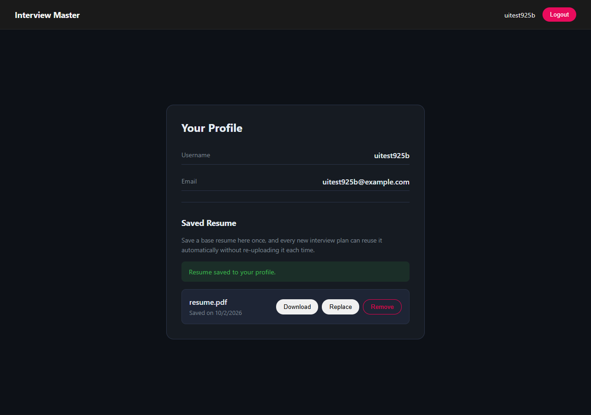

# Interview Master

An AI-powered interview prep tool. Paste a target job description, add a
resume or a quick self-description, and get back a structured mock-interview
pack: a match score, likely technical and behavioral questions (each with
the interviewer's intention and a model answer), a skill-gap breakdown, a
day-by-day preparation roadmap, and a tailored, ATS-friendly resume PDF for
that specific job. Save a base resume to your profile once and every future
plan reuses it automatically.

## Screenshots

| Login | Home | Profile | Interview Report |
|---|---|---|---|
|  |  |  |  |

## Why this project

Most "AI wrapper" demos pipe a prompt straight to an LLM and print whatever
comes back. This one doesn't:

- **LLM output is schema-constrained, not parsed.** Both the interview
  report and the generated resume are defined as Zod schemas, converted to
  a JSON schema, and passed to Gemini's `responseSchema` — the model is
  forced to return exactly that shape instead of free text that then has to
  be regex'd or hoped into structure.
- **Auth does real session invalidation, not just token expiry.** Logout
  adds the JWT to a blacklist collection (Mongo TTL-indexed to self-clean
  after 24h), so a copied cookie is dead immediately, not just "eventually."
- **A real multi-step pipeline:** PDF upload → text extraction (`pdf-parse`)
  → LLM analysis → structured storage → on-demand PDF regeneration
  (Gemini writes resume HTML, Puppeteer renders it).
- **CSRF-protected, not just CORS-protected.** Mutating routes require a
  double-submit CSRF token in addition to the auth cookie, and uploaded
  PDFs are verified by file signature, not just the client-supplied
  mimetype.

## Tech stack

**Backend** — Node.js, Express 5, MongoDB/Mongoose, JWT (httpOnly cookies),
bcrypt, Zod (both for request validation and for constraining LLM output),
Multer, `pdf-parse`, Puppeteer, `@google/genai` (Gemini), Helmet,
express-rate-limit.

**Frontend** — React 19, React Router 7, Axios, Sass. Light/dark theme via
CSS custom properties, persisted to `localStorage`.

**Testing** — Jest + Supertest (backend).

## Getting started

Requires Node 18+, a MongoDB connection string (Atlas or local), and a
[Gemini API key](https://aistudio.google.com/apikey).

```bash
# Backend
cd Backend
npm install
cp .env.example .env   # fill in MONGO_URI, JWT_SECRET, GOOGLE_GENAI_API_KEY
npm run dev             # http://localhost:3000

# Frontend (separate terminal)
cd Frontend
npm install
cp .env.example .env    # defaults to http://localhost:3000, override if needed
npm run dev              # http://localhost:5173
```

Run the backend test suite with `cd Backend && npm test`.

## Project structure

```
Backend/
  src/
    controllers/   # request handling, one file per resource
    services/      # Gemini calls, Puppeteer PDF rendering
    models/        # Mongoose schemas
    middlewares/    # auth, CSRF, file upload, rate limiting
    validators/     # Zod request-body schemas
    utils/          # shared helpers (PDF text extraction)
    routes/
  tests/           # Jest + Supertest

Frontend/
  src/
    features/
      auth/         # login/register pages, auth context, navbar
      interview/    # home (report generation), report viewer
      profile/      # saved-resume management
```

## API overview

| Route | Auth | Description |
|---|---|---|
| `POST /api/auth/register` | Public | Create an account, sets an auth cookie |
| `POST /api/auth/login` | Public | Log in, sets an auth cookie |
| `GET /api/auth/logout` | Public | Blacklists the current token, clears the cookie |
| `GET /api/auth/get-me` | Private | Current user, used to restore sessions on load |
| `GET /api/users/profile` | Private | Current user + saved-resume metadata |
| `PUT /api/users/resume` | Private | Save/replace the resume stored on the profile |
| `GET /api/users/resume` | Private | Download the saved resume PDF |
| `DELETE /api/users/resume` | Private | Remove the saved resume |
| `PUT /api/users/email` | Private | Change email (requires current password) |
| `PUT /api/users/password` | Private | Change password (requires current password) |
| `POST /api/interview/` | Private | Generate a report from a job description + resume/self-description (falls back to the profile's saved resume if neither is given) |
| `GET /api/interview/` | Private | List the logged-in user's reports |
| `GET /api/interview/report/:id` | Private | Fetch one report |
| `DELETE /api/interview/report/:id` | Private | Delete one report |
| `POST /api/interview/resume/pdf/:id` | Private | Generate and download a tailored resume PDF for that report |

`/api/auth/login` and `/api/auth/register` are rate-limited (20 requests /
15 min per IP). `POST /api/interview/` is rate-limited separately (15
requests / hour per IP) since each call is a paid, ~10s Gemini request.
Every mutating route above (PUT/POST/DELETE, except register/login which
don't have a session yet) requires an `X-CSRF-Token` header matching the
`csrfToken` cookie issued at login — see "Security" below.

## Security

- **Auth:** JWT in an httpOnly cookie (unreadable by JS, immune to XSS
  token theft), 1-day expiry. Logout blacklists the token server-side
  (Mongo TTL-indexed, auto-expires after 24h) instead of only clearing the
  cookie, so a stolen cookie dies immediately on logout rather than
  lingering until natural expiry.
- **CSRF:** double-submit cookie pattern. Login/register also issue a
  `csrfToken` cookie (readable by JS, unlike the auth cookie), which the
  frontend echoes back as an `X-CSRF-Token` header on every mutating
  request (`Frontend/src/lib/api.js`). The backend rejects a mismatch with
  403 (`Backend/src/middlewares/csrf.middleware.js`). This matters because
  `SameSite=None` is required in production for a cross-origin
  frontend/backend split, which otherwise allows some cross-site requests
  to carry the user's cookies automatically.
- **File uploads:** validated by magic bytes (`%PDF-` signature), not just
  the client-supplied `Content-Type`, which is trivially spoofable.
- **Passwords:** bcrypt-hashed; changing the email or password requires
  re-entering the current password.
- **Rate limiting:** auth routes and report generation are capped
  separately (see above) via `express-rate-limit`.
- **Headers:** `helmet` sets standard security headers on every response.

## Deployment notes

- Set `NODE_ENV=production` on the backend host so auth cookies switch to
  `Secure` + `SameSite=None` (required for a cross-origin frontend/backend
  split, e.g. Vercel + Render).
- Set `CLIENT_URL` (backend) to the deployed frontend origin, and
  `VITE_API_URL` (frontend) to the deployed backend origin.
- Puppeteer needs a host with real Chromium support for the resume-PDF
  feature — most serverless/free-tier PaaS don't ship it by default. A
  Docker-based host, or swapping to `@sparticuz/chromium` for serverless,
  are the two common fixes.

## License

ISC
